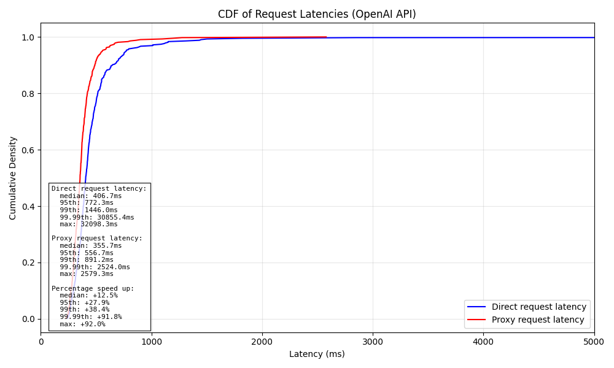

# LLM TTFB Proxy

This project provides a simple Go proxy server designed to reduce the Time To First Byte (TTFB) latency for Language Model (LLM) API requests, particularly relevant for real-time applications like voice agents.

## The Problem: LLM Latency in Voice Agents

Voice agents typically involve a pipeline like Speech-to-Text (STT) -> LLM Inference -> Text-to-Speech (TTS). A significant source of user-perceived delay in this pipeline is the LLM's TTFB - the time it takes for the LLM to generate and return the very first token of its response. While overall inference speed (tokens per second) is important, the initial delay before anything is returned is crucial for responsiveness in interactive applications.

## The Solution: Request Hedging

This proxy server addresses the TTFB issue by implementing a request hedging strategy. When a request is received by the proxy, it sends **multiple (n=2)** identical requests concurrently to the target LLM API (e.g., OpenAI). The proxy then waits for the **first successful response** from any of these concurrent requests and streams or returns that response to the client. The other ongoing requests are cancelled.

This significantly increases the probability of getting the first byte back faster, as you only need one out of \(n\) requests to complete quickly, rather than waiting for a single request that might experience network jitters or backend delays.

The core logic for this can be seen in `proxy/main.go`, specifically within the `handleStreamingRequest` and `handleNonStreamingRequest` functions where multiple goroutines are spawned to perform the requests concurrently.

## Performance: TTFB Improvement

Testing against the OpenAI API (`gpt-4o-mini` model) with a set of prompts (`test.py`), the proxy demonstrates a clear reduction in TTFB (measured as the time until the first byte or chunk is received for streaming, or the full response for non-streaming, but the primary benefit is for TTFB which is critical for streaming):

**Sample Latency Statistics (TTFB focus, n=2 requests):**

- **Direct requests:** Count: 93, Mean: 498.47ms, Median: 411.27ms
- **Proxy requests:** Count: 93, Mean: 405.13ms, Median: 378.58ms

This shows a noticeable reduction in both mean and median latency when using the proxy for TTFB-sensitive scenarios.

The following Cumulative Distribution Function (CDF) plot visualizes this TTFB improvement:

_This graph was generated using the `test.py` script._

While the examples and testing focus on OpenAI, this technique is applicable to other LLM providers.

## Important Caveat: Full Inference Speed

While request hedging is effective at reducing TTFB, it comes with a hidden cost for **full inference** speed (the time it takes to receive the _entire_ response). Because the proxy might still incur overhead managing multiple connections or waiting for the first of the _n_ requests to complete its _entire_ response (depending on the exact cancellation logic), it can sometimes be slower for receiving the full response compared to a single direct request, especially if the fastest TTFB response isn't also the fastest full response.

**Sample Latency Statistics (Full Inference focus, n=2 requests):**

- **Direct requests:** Count: 157, Mean: 3507.61ms, Median: 3239.53ms
- **Proxy requests:** Count: 157, Mean: 4162.42ms, Median: 3937.37ms

As shown by these numbers, the proxy can introduce overhead for full inference. Therefore, this proxy is **not recommended** for use cases where minimizing the time to receive the complete response is the primary goal (e.g., batch processing, summarization where the full text is needed before processing). Its value is specifically in reducing the initial delay (TTFB) for interactive applications.

## Project Structure

- `proxy/main.go`: Contains the Go proxy server implementation.
- `backend/test.py`: A Python script using `pytest` and `asyncio` to measure and compare latencies between direct OpenAI API calls and requests via the proxy.
- `backend/prompts.json`: A JSON file containing prompts used by the `test.py` script.

## Setup and Running

1.  **Prerequisites:** Go, Python 3, `pytest`, `openai`, `numpy`, `matplotlib`. While `uv` is used for package management in this project, using `pip` directly will also work to install the necessary Python packages.
2.  **Environment Variables:** Set the `OPENAI_API_KEY` environment variable for both the proxy (`main.go`) and the test script (`test.py`). You can also set a `PORT` for the Go proxy (defaults to `8080`).
3.  **Run the Proxy:** Navigate to the `proxy` directory and run `go run main.go`.
4.  **Run the Latency Test:** Navigate to the `backend` directory and run `pytest test.py`. This will run the tests, print summary statistics, and generate the `openai_latency_comparison.png` file.

## Conclusion

This LLM TTFB Proxy demonstrates an effective technique using request hedging to significantly reduce the Time To First Byte, making LLM integration in real-time applications like voice agents feel more responsive. Users should be aware of the trade-off, as this comes at the potential cost of increased total latency for the full response.
